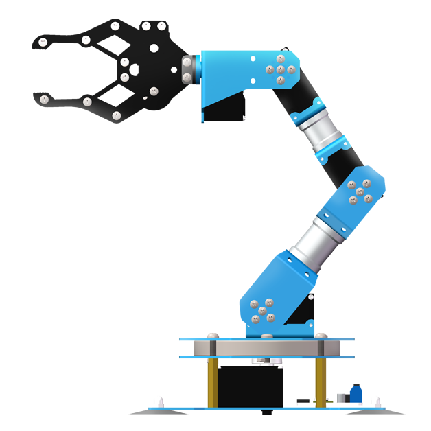
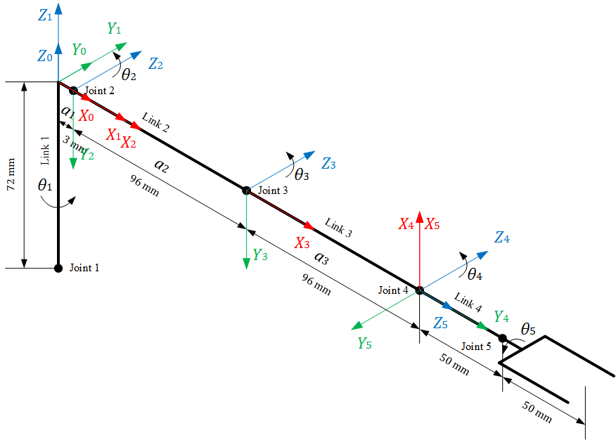
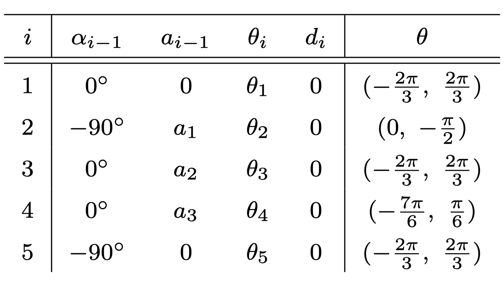

# 5_dof_manipulator

## 机械臂

- 品牌：LOBOT

- 型号：xArm

- 自由度：5

  

## DH 建模

- 坐标系

  

- DH 参数表

  

## 使用方法

- 在 [modified_dh_matrix.m](scripts/modified_dh_matrix.m) 中输入 DH 参数，得到基坐标系到末端坐标系的齐次变换矩阵

- 将各个相邻坐标系的齐次变换矩阵输入 [inverse_kinematics.m](scripts/inverse_kinematics.m) 可得到逆运动学解，即各个关节角度（目前仅为关节 1、2 和 3）的符号表达式，前三个关节的逆运动学解共有 16 组

- 使用 [ik_verify.m](scripts/ik_verify.m) 可验证逆运动学解的表达式是否正确

## 参考

- [Puma560 机器人 DH 变换](https://blog.csdn.net/pengjc2001/article/details/70156333)

- [机器人学一（Robotics 1）](https://zh.coursera.org/learn/robotics1)

## TODO List

- [ ] 完成后 2 关节的逆运动学求解

- [ ] 将逆运动学求解过程封装为函数，方便调用
